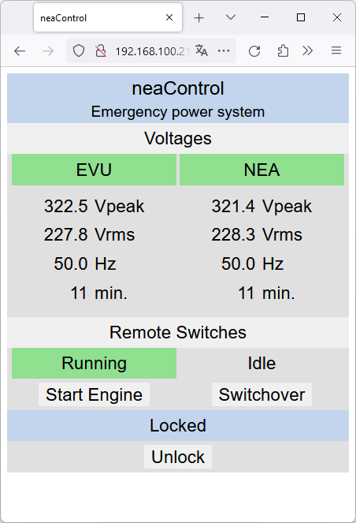
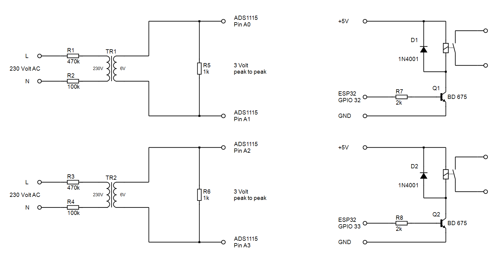

# neaControl
ESP32 based control of an emergency power system
#### Features
* uses W5500 PHY/MAC for 100Base-T ethernet
  * supports DHCP and static IP
* uses ADS1115 16Bit ADC with transformer
* measures peak voltage, rms voltage and frequency from EVU and NEA
  * EVU "Energieversorgungsunternehmen" Energy supply company
  * NEA "Netzersatzanlage" Emergency power system
* operational Web UI URL: http://x.x.x.x/
* configuration Web UI URL: http://x.x.x.x/config/
* simple HTTP polling interface
#### GPIO ADS1115 (I2C)
* GPIO 21 - SDA
* GPIO 22 - SCL
* GPIO 25 - ALRT
#### GPIO W5500 (SPI)
* GPIO 23 - MOSI
* GPIO 19 - MISO
* GPIO 18 - CLK
* GPIO  5 - CS
* GPIO 26 - INT
* GPIO 27 - RST
#### Web UI

#### Schematic
